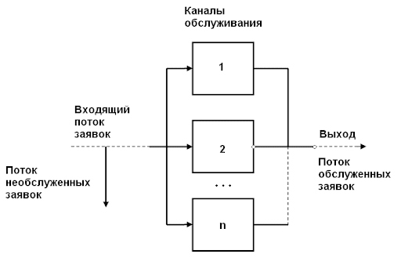

# МИПиС

## Task 07. Моделирование СМО: "клиент-сервер"

Срок выполнения работы: **до 10 мая**

В данной работе моделируется работа многоканальной системы массового обслуживания с отказами на примере взаимодействия "клиент/сервер".

Теоретический материал по данной работе представлен в лекции №5 курса МИПиС.

### Постановка задачи

Схема многоканальной СМО с отказами приведена на следующем рисунке

В систему (сервер) поступает входной поток заявок определенной интенсивности (запросы клиентов). У сервера есть **n** активных потоков (каналов) для обслуживания клиентских запросов. Если поток свободен, то он принимает на себя обслуживание. Если все потоки заняты обслуживанием, входящая заявка получает отказ и соединение с клиентов не устанавливается.

Необходимо написать приложение на языке C\#, в котором моделируется СМО с отказами.

### Описание задачи

В рамках задачи необходимо разработать класс **Server** с пулом потоков определенной величины и класс **Client** для генерирования запросов к серверу. Ссылку на объект сервера клиент получает в качестве параметра конструктора. При этом происходит связывание события клиента и обработчика события сервера. С этого момента объект клиента можен генерировать события, которые будут перехватываться и обрабатываться сервером.

При поступлении запроса от клиента, сервер должен найти в пуле свободный поток, запустить его и передать ему информацию о запросе. Поток, получив информацию, имитирует обработку (временная задержка). Если в пуле все потоки заняты, то происходит отклонение запроса.

Программа должна фиксировать:

- количество поступивших запросов
- количество обслуженных запросов
- количество отклоненных запросов

В главном классе программы **Program** необходимо разместить сценарий для моделирования, в котором устанавливаются параметры

- интенсивность потока заявок (запросов)
- интенсивность потока обслуживания

### Процедура исследования СМО

С помощью программы необходимо установить параметры системы, и на основе собранной статистики, рассчитать следующие показатели СМО:

- вероятность простоя системы
- вероятность отказа системы
- относительная пропускная способность
- абсолютная пропускная способность
- среднее число занятых каналов

Рассчитать данные показатели по формулам, приведенных в лекции №5 и сравнить их с результатами обработки статистики.

По результатам сделать вывод

### Алгоритм подготовки решения

- создать новое решение (sln) **NET Core**
- создать новый проект (csproj)
- добавить в проект описание классов **Server** и **Client**
- добавить в класс **Program** сценарий для моделирования и исследования СМО
- убедиться в работоспособности проекта
- провести исследование СМО, накопить статистику и получить результаты сравнения с теоретическими рассчетами
- написать отчет по результатам моделирования
- поместить решение в корневую папку репозитория (см. для примера предыдущие проекты)
- выполнить загрузку репозитория на GitHub
- создать пул-запрос и дождаться проверки корректности построения приложения

### Список участников/веток

см. репозиторий `mod-branches`

